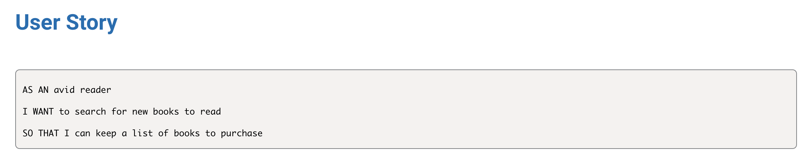
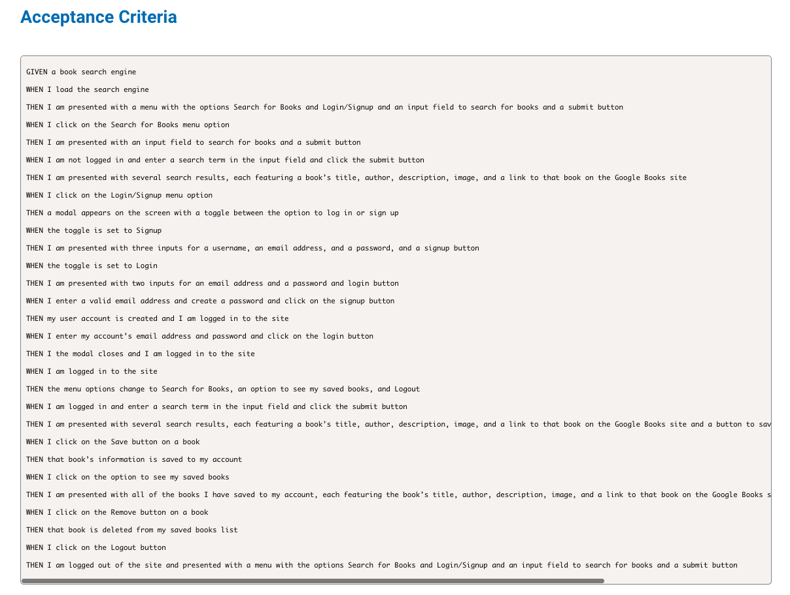

# Book Search Engine
  

## Table of Contents
  - [Project description](#description)
  - [Installation](#installation)
  - [License](#license)

## Description 
I took a fully functioning Google Books API search engine built with a RESTful API, and refactored it to be a GraphQL API built with Apollo server. The app was originally built using the MERN stack, with a React front end, MongoDB database, and Node.js/Express.js server and API. It was already set up to allow users to save book searches to the back end, but was then modified with the following steps:

* Set up an Apollo Server to use GraphQL queries and mutations to fetch and modify data, replacing the existing RESTful API

* Updated existing authentication middleware so that it works in the context of a GraphQL API

* Created an Apollo Provider so that requests can communicate with an Apollo Server

* Deploy the application to Heroku

  
## Installation
Installation of concurrently
* Use npm i concurrently

For the server side; Installation of Apollo Server 2
* Use npm install apollo-server-express@2.15.0

Installation of jsonwebtoken
* Use npm i jsonwebtoken

Installation of graphql
* Use npm i graphql

Installation of bcrypt
* Use npm install bcrypt

Installation of Mongoose
* Use npm i mongoose

Installation of Apollo Client
* Use npm i @apollo/client

## Questions?
Please contact me at:
GitHub: https://github.com/elawilliam
Email: ela.witham@gmail.com
  
## License 
Book Search Engine is licensed under the: 
  
